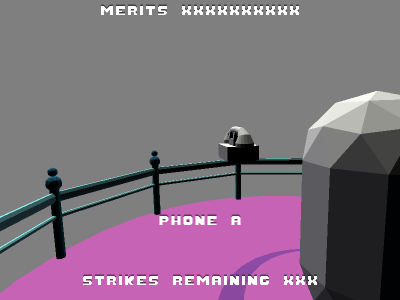

# Game Information

Title: Another Infinite Night at the Orbital Phone Bank

Author: Kai Kuehner (design by Jim McCann)

Design Document: [Another Infinite Night at the Orbital Phone Bank](http://graphics.cs.cmu.edu/courses/15-466-f18/game1-designs/default/)

Screen Shot:



How To Play:

Use the mouse to look around and WASD to move. Press space when near a phone to pick it up. Use WASD and space to navigate the menu.

Answer the ringing phones and follow their instructions. You'll have to use your ears to figure out which phone is ringing, so headphones are recommended. (You can also just try picking up the phones and seeing if they have something to say to you.)

Answer 10 calls correctly to win. If you are too slow or give misinformation, you get a strike. After 3 strikes, you lose.

Changes From The Design Document:

There are only two phones on the main platform, because that was what was in the model.

The phones are labeled A, B, C, and D instead of by color. They also do not change color when ringing. I could not figure out how to change mesh color. Instead the phone tells you its name when you get close.

Good / Bad / Ugly Code:

Good: The proximity-based phone name display works pretty well.

Bad: I couldn't get walk meshes working, so the player just floats around. It's still playable though.

Ugly: I couldn't figure out how to add custom characters to the font (when I tried to add them to the blender mesh, the renderer would immediately crash), so I just used letters for everything.

Credits:

Seashore Peace Ambiance by Philippe Groarke- http://opengameart.org/content/seashore-peace-ambiance (CC-BY-SA 3.0)
Phone sound by cbakos- https://freesound.org/people/cbakos/sounds/50646/

# Using This Base Code

Before you dive into the code, it helps to understand the overall structure of this repository.
- Files you should read and/or edit:
    - ```main.cpp``` creates the game window and contains the main loop. You should read through this file to understand what it's doing, but you shouldn't need to change things (other than window title, size, and maybe the initial Mode).
    - ```GameMode.*pp``` declaration+definition for the GameMode, which is the base0 code's Game struct, ported to use the new helper classes and loading style.
    - ```CratesMode.*pp``` a game mode that involves flying around a pile of crates. Demonstrates (somewhat) how to use the Scene object. You may want to use this rather than GameMode as the starting point for your game.
    - ```WalkMesh.*pp``` starter code that might become walk mesh code with your diligence.
    - ```Sound.*pp``` spatial sound code. Relatively complete, but please read and understand.
    - ```meshes/export-meshes.py``` exports meshes from a .blend file into a format usable by our game runtime. You might want to also use this to export your WalkMesh.
    - ```meshes/export-scene.py``` exports the transform hierarchy of a blender scene to a file. Probably very useful for your game.
    - ```Jamfile``` responsible for telling FTJam how to build the project. If you add any additional .cpp files or want to change the name of your runtime executable you will need to modify this.
    - ```.gitignore``` ignores the ```objs/``` directory and the generated executable file. You will need to change it if your executable name changes. (If you find yourself changing it to ignore, e.g., your editor's swap files you should probably, instead be investigating making this change in the global git configuration.)
- Files you should read the header for (and use):
    - ```MenuMode.hpp``` presents a menu with configurable choices. Can optionally display another mode in the background.
    - ```Scene.hpp``` scene graph implementation.
    - ```Mode.hpp``` base class for modes (things that recieve events and draw).
    - ```Load.hpp``` asset loading system. Very useful for OpenGL assets.
    - ```MeshBuffer.hpp``` code to load mesh data in a variety of formats (and create vertex array objects to bind it to program attributes).
    - ```data_path.hpp``` contains a helper function that allows you to specify paths relative to the executable (instead of the current working directory). Very useful when loading assets.
    - ```draw_text.hpp``` draws text (limited to capital letters + *) to the screen.
    - ```compile_program.hpp``` compiles OpenGL shader programs.
- Files you probably don't need to read or edit:
    - ```GL.hpp``` includes OpenGL prototypes without the namespace pollution of (e.g.) SDL's OpenGL header. It makes use of ```glcorearb.h``` and ```gl_shims.*pp``` to make this happen.
    - ```make-gl-shims.py``` does what it says on the tin. Included in case you are curious. You won't need to run it.
    - ```read_chunk.hpp``` contains a function that reads a vector of structures prefixed by a magic number. It's surprising how many simple file formats you can create that only require such a function to access.

## Asset Build Instructions

In order to generate the ```dist/crates.pnc``` file, tell blender to execute the ```meshes/export-meshes.py``` script:

```
blender --background --python meshes/export-meshes.py -- meshes/crates.blend dist/crates.pnc
```

In order to generate the ```dist/crates.scene``` file, tell blender to execute the ```meshes/export-scene.py``` script:

```
blender --background --python meshes/export-scene.py -- meshes/crates.blend dist/crates.scene
```

There is a Makefile in the ```meshes``` directory that will do this for you.

## Runtime Build Instructions

The runtime code has been set up to be built with [FT Jam](https://www.freetype.org/jam/).

### Getting Jam

For more information on Jam, see the [Jam Documentation](https://www.perforce.com/documentation/jam-documentation) page at Perforce, which includes both reference documentation and a getting started guide.

On unixish OSs, Jam is available from your package manager:
```
	brew install ftjam #on OSX
	apt get ftjam #on Debian-ish Linux
```

On Windows, you can get a binary [from sourceforge](https://sourceforge.net/projects/freetype/files/ftjam/2.5.2/ftjam-2.5.2-win32.zip/download),
and put it somewhere in your `%PATH%`.
(Possibly: also set the `JAM_TOOLSET` variable to `VISUALC`.)

### Libraries

This code uses the [libSDL](https://www.libsdl.org/) library to create an OpenGL context, and the [glm](https://glm.g-truc.net) library for OpenGL-friendly matrix/vector types.
On MacOS and Linux, the code should work out-of-the-box if if you have these installed through your package manager.

If you are compiling on Windows or don't want to install these libraries globally there are pre-built library packages available in the
[kit-libs-linux](https://github.com/ixchow/kit-libs-linux),
[kit-libs-osx](https://github.com/ixchow/kit-libs-osx),
and [kit-libs-win](https://github.com/ixchow/kit-libs-win) repositories.
Simply clone into a subfolder and the build should work.

### Building

Open a terminal (or ```x64 Native Tools Command Prompt for VS 2017``` on Windows), change to the directory containing this code, and type:

```
jam
```

That's it. You can use ```jam -jN``` to run ```N``` parallel jobs if you'd like; ```jam -q``` to instruct jam to quit after the first error; ```jam -dx``` to show commands being executed; or ```jam main.o``` to build a specific file (in this case, main.cpp).  ```jam -h``` will print help on additional options.
